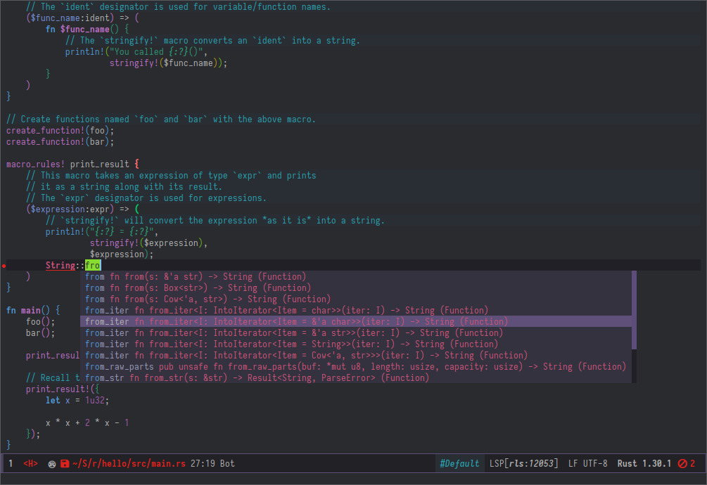
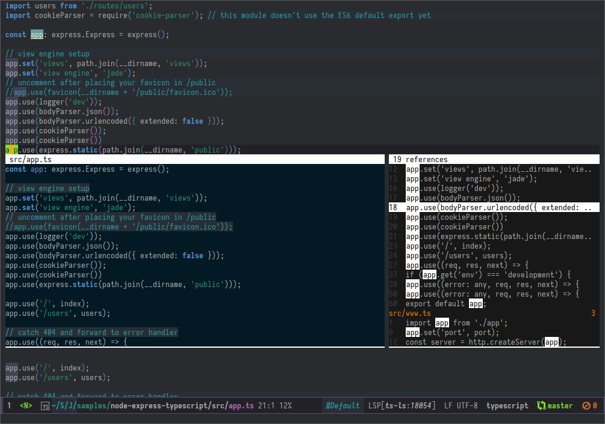

emacs-lsp
=========

[](https://travis-ci.org/vibhavp/emacs-lsp)
[](http://melpa.org/#/lsp-mode)

A Emacs Lisp library for implementing clients for servers using Microsoft's
[Language Server Protocol](https://github.com/Microsoft/language-server-protocol/).

The library is designed to integrate with existing Emacs IDE frameworks
(completion-at-point, xref (beginning with Emacs 25.1), flycheck, etc).

*This package is still under development, and is not recommended for daily use.*
## Installation

Clone this repository to a suitable path, and add
```emacs-lisp
(add-to-list 'load-path "<path to emacs-lsp>")
(require 'lsp-mode)
(global-lsp-mode t)
```
to your .emacs.
## Clients

The library currently defines clients for [Rust Language Server](https://github.com/jonathandturner/rls)
and [Sourcegraph's Go Language Server](https://github.com/sourcegraph/go-langserver). 
For now, the only supported transport is stdio (see `lsp-mode.el` on how to add your 
own clients), support for TCP and sockets is planned.

## Examples

### completion
Completion is provided with the native `completion-at-point` (<kbd>C</kbd>-<kbd>M</kbd>-<kbd>i</kbd>),
 and should therefore work with any other completion backend.



### `eldoc` (Help on hover)
Hover support is provided with `eldoc`, which should be enabled automatically.


### Goto definition
Use <kbd>M</kbd> - <kbd>.</kbd> (`xref-find-definition`)
to find the definition for the symbol under point.


### Symbol references
Use <kbd>M</kbd> - <kbd>?</kbd> (`xref-find-references`)
to find the references to the symbol under point.


